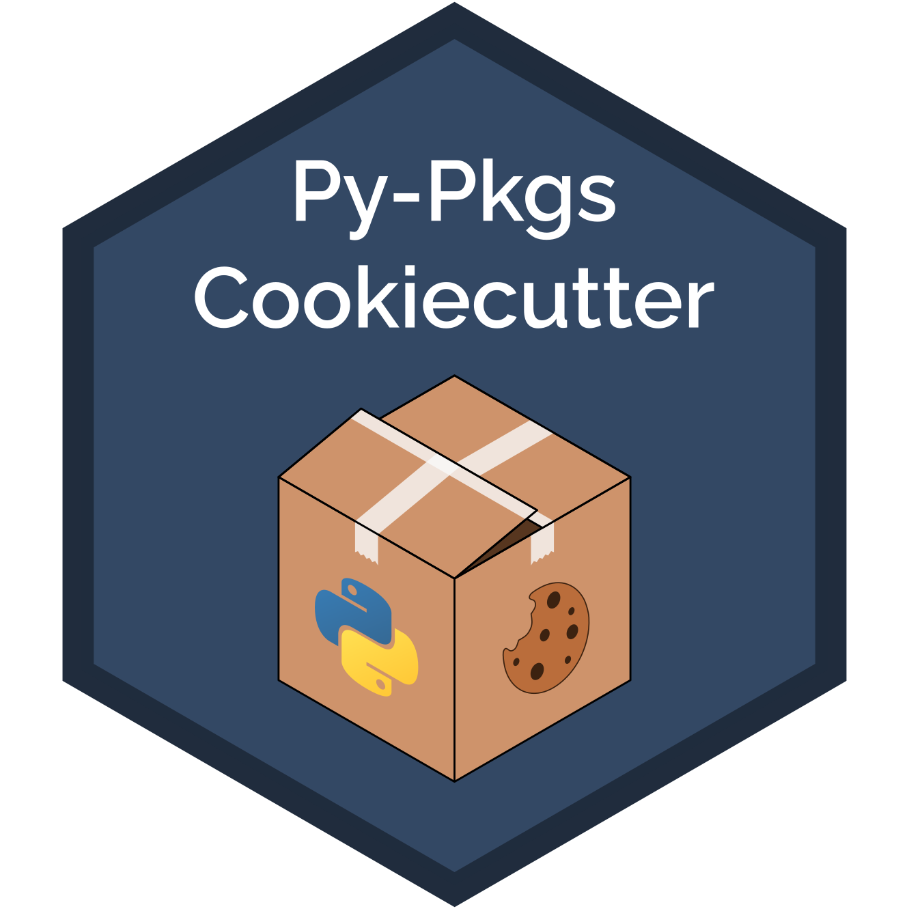

# Py-Pkgs-Cookiecutter: A cookiecutter template for Python packages

[](https://py-pkgs-cookiecutter.readthedocs.io/en/latest/)

[](https://github.com/py-pkgs/py-pkgs-cookiecutter/releases)
[]()
[]()

<p align="center">
  
</p>

<br>

`py-pkgs-cookiecutter` is a [`cookiecutter`](https://cookiecutter.readthedocs.io/en/latest/) template for creating a fully-featured Python package using [`poetry`](https://python-poetry.org). It supplements the [Python Packages book](https://py-pkgs.org) by Tomas Beuzen and Tiffany Timbers but can be used independently.

## Usage

Please see the [documentation](https://py-pkgs-cookiecutter.readthedocs.io/en/latest/) for more detail on using `py-pkgs-cookiecutter`. We provide the fundamental steps below:

1. Install [`cookiecutter`](https://cookiecutter.readthedocs.io/en/latest/):

    ```bash
    pip install cookiecutter
    ```

2. Generate a Python package structure using [`py-pkgs-cookiecutter`](https://github.com/py-pkgs/py-pkgs-cookiecutter):

    ```bash
    cookiecutter https://github.com/py-pkgs/py-pkgs-cookiecutter.git
    ```

3. After responding to the prompts you should have a directory structure similar to that shown below. To learn more about the contents of this directory structure, please see the `py-pkgs-cookiecutter` [documentation](https://py-pkgs-cookiecutter.readthedocs.io/en/latest/).

    ```text
    pkg
    ├── .github                    ┐
    │   └── workflows              │ GitHub Actions workflow
    │       └── ci-cd.yml          ┘
    ├── .gitignore                 ┐
    ├── .readthedocs.yml           │
    ├── CHANGELOG.md               │
    ├── CONDUCT.md                 │
    ├── CONTRIBUTING.md            │
    ├── docs                       │
    │   ├── make.bat               │
    │   ├── Makefile               │
    │   ├── requirements.txt       │
    │   ├── changelog.md           │
    │   ├── conduct.md             │
    │   ├── conf.py                │ Package documentation
    │   ├── contributing.md        │
    │   ├── index.md               │
    │   └── usage.ipynb            │
    ├── LICENSE                    │
    ├── README.md                  ┘
    ├── pyproject.toml             ┐ 
    ├── src                        │
    │   └── pkg                    │ Package source code, metadata,
    │       ├── __init__.py        │ and build instructions 
    │       └── pkg.py             ┘
    └── tests                      ┐
        └── test_pkg.py            ┘ Package tests
    ```

## Contributing

Interested in contributing? Check out the [Contributing Guidelines](https://py-pkgs-cookiecutter.readthedocs.io/en/latest/contributing.html). Please note that this project is released with a [Code of Conduct](https://py-pkgs-cookiecutter.readthedocs.io/en/latest/conduct.html). By contributing to this project, you agree to abide by its terms.

## License

`py-pkgs-cookiecutter` was created by Tomas Beuzen and Tiffany Timbers. It is licensed under the terms of the BSD license.

## Acknowledgements

`py-pkgs-cookiecutter` was originally developed for use in the University of British Columbia's (UBC) `Master of Data Science`_ program (MDS). It was inspired by the pyOpenSci `cookiecutter` [template](https://github.com/pyOpenSci/cookiecutter-pyopensci).
